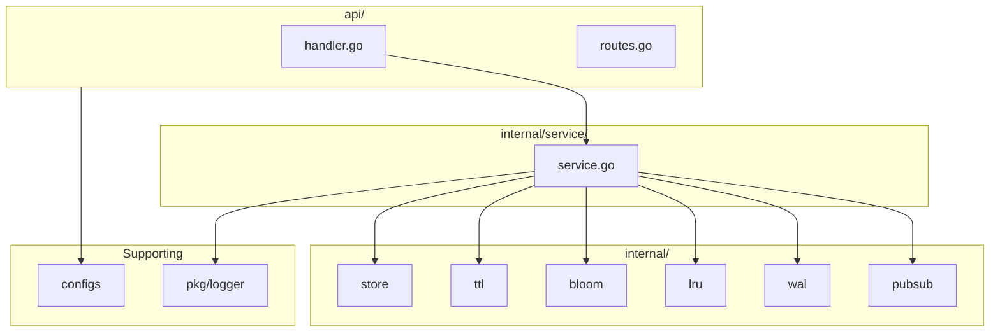

# In-Memory Database (Go)

A production-ready in-memory key-value database with TTL, Bloom filter optimization, LRU eviction, WAL persistence, and PubSub messaging—exposed via HTTP APIs.

## Features

- **Thread-safe storage**: `sync.RWMutex`-protected key-value store
- **TTL (Time-To-Live)**: Background worker cleans expired keys periodically
- **Bloom filter**: Avoids unnecessary DB lookups for non-existent keys
- **LRU eviction**: When at capacity, evicts least recently used keys
- **WAL persistence**: Write-Ahead Log for durability; replay on startup
- **PubSub**: Subscribe and publish messages to channels
- **HTTP API**: REST endpoints for all operations

## Architecture



**Data flow**: HTTP Request → Handler → Service (Bloom check, Store ops, WAL write) → Response

## Quick Start

```bash
# Run the server
go run ./cmd/server/

# Or use the script
chmod +x scripts/run.sh && ./scripts/run.sh
```

Server listens on `:8080` by default.

## Configuration

| Env Variable | Description | Default |
|-------------|-------------|---------|
| `PORT` | HTTP server port | `8080` |
| `MAX_KEYS` | LRU capacity (max keys before eviction) | `10000` |
| `TTL_INTERVAL` | TTL worker scan interval (e.g. `1s`) | `1s` |
| `WAL_PATH` | Write-Ahead Log file path | `./data/wal.log` |
| `LOG_LEVEL` | `debug`, `info`, `warn`, `error` | `info` |
| `CONFIG_PATH` | Optional YAML config file path | — |

## API Examples

### Key-Value Operations

```bash
# Set a key
curl -X POST http://localhost:8080/set \
  -H "Content-Type: application/json" \
  -d '{"key":"foo","value":"bar"}'

# Set with TTL (60 seconds)
curl -X POST http://localhost:8080/set \
  -H "Content-Type: application/json" \
  -d '{"key":"foo","value":"bar","ttl":60}'

# Get a key
curl http://localhost:8080/get/foo

# Delete a key
curl -X DELETE http://localhost:8080/delete/foo
```

### PubSub

```bash
# Publish a message
curl -X POST http://localhost:8080/publish \
  -H "Content-Type: application/json" \
  -d '{"channel":"alerts","message":"hello"}'

# Subscribe (SSE stream)
curl -N http://localhost:8080/subscribe/alerts
```

## Project Structure

```
in_memory_db/
├── cmd/server/main.go      # Entry point
├── internal/
│   ├── store/              # Core KV store
│   ├── ttl/                # Expiry worker
│   ├── bloom/              # Bloom filter
│   ├── lru/                # LRU eviction
│   ├── wal/                # Write-Ahead Log
│   ├── pubsub/             # Pub/Sub messaging
│   └── service/            # Business logic
├── api/                    # HTTP handlers & routes
├── configs/                # Configuration
├── pkg/logger/             # Logging
└── scripts/                # Run, build, test
```

## Development Phases

1. **Phase 1**: Store (SET, GET, DELETE)
2. **Phase 2**: TTL + concurrency
3. **Phase 3**: Bloom filter + LRU
4. **Phase 4**: Persistence (WAL) + API + PubSub

## Build & Test

```bash
./scripts/build.sh   # Build to bin/server
./scripts/test.sh    # Run tests
```
